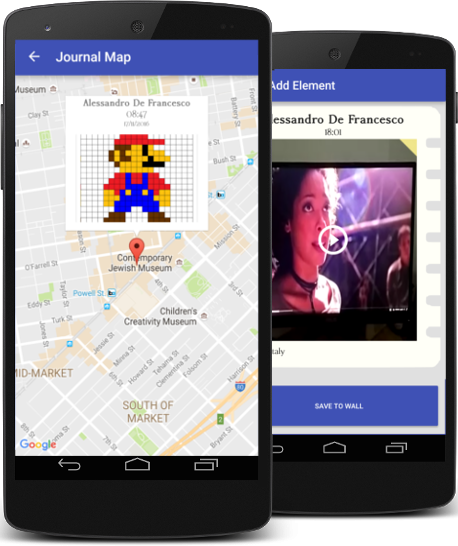

University project developer for the course "Development of applications for mobile devices".
The purpose of the project is the development of an application for Android and iOS in native languages and tools (Java / Android Studio and Objective-C / XCode).

The application was designed with the aim of providing users with an easy and intuitive way to collect their memories of journeys made during their life in one place and to share them with their fellow travelers. In fact, the user interface has been developed with the appearance of a real journal in which each page contains a specific memory.

The important features developed for the application are:
- Creation of travel journals.
- Sharing travel journals with other users.
- Possibility for each user to add photos, videos and texts to shared journals.
- Remote storage of photos, videos and texts.
- REST server to centralize the storage of photos, videos and texts of each journal.
- Login through Facebook.
- Saving metadata for every memory (date, owner, location).
- Integrated maps for the geolocation of memories.

We also developed a prototype for the website dedicated to the application, available at  http://travelnotesapp.altervista.org/.

Developed in 2017 by:
Alessandro De Francesco,
Gianpaolo Caprara
